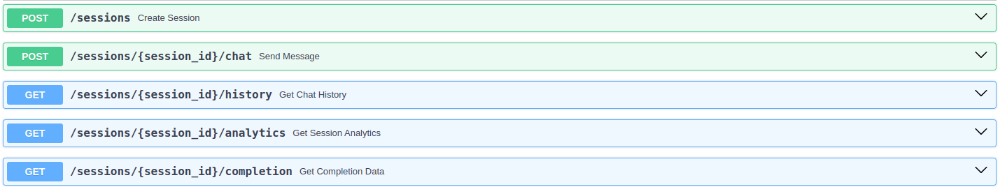

# Travelliko – AI Travel Assistant

Travelliko Bot is a conversational AI assistant designed to help users plan safe, exciting, and highly personalised international trips. It collects essential trip details via a friendly and persistent chat experience and builds a complete travel itinerary based on the user’s inputs.

---

## Features

- **Dynamic Travel Planning**: Gathers user preferences such as destination, budget, duration, food, and activities.
- **Persistent Data Collection**: Each travel parameter (e.g., budget, accommodation) is collected via smart and consistent follow-up.
- **Safety-First Suggestions**: Avoids unsafe or high-risk destinations, always recommending safe, accessible alternatives.
- **Natural Dialogue Flow**: Engages with warm, human-like responses that keep users interested and involved.
- **Custom Roles for Each Input**: Each required detail is handled by a specific conversational role for better clarity and persistence.

---

## Core Conversation Fields

Travelliko Bot asks the user for the following information:

| Field          | Question Prompt                                                                                      |
|----------------|-------------------------------------------------------------------------------------------------------|
| Destination    | "Where are you dreaming of going for this trip?"                                                    |
| Departure City | "Where will you be starting your journey from?" (Country names not accepted)                        |
| Travel Period  | "How long are you planning to travel? (Pick between 3 to 15 days!)"                                  |
| People         | "Who's coming along? Just you, or is it a group trip?"                                               |
| Budget         | "Got a budget in mind? Share a number or a range in USD (e.g., low, medium, high)."                 |
| Accommodation  | "What kind of stay are you imagining? Cozy, luxurious, or something unique?"                        |
| Activities     | "Any must-do experiences or sights you've got on your wishlist?"                                    |
| Food           | "What kind of food are you craving to try on this trip? Any dietary needs I should know?"           |

---

## Role-based Persistence

Each field is backed by a dedicated **conversational role**, ensuring the bot:

- **Follows up** until it gets a **specific, valid response**
- **Handles vague replies**, redirects when needed, and ensures **clarity and completeness**
- **Provides examples and suggestions** when users are unsure

---

## Safety Considerations

- Recommends **only safe and accessible destinations**
- Redirects users from high-risk areas with **empathetic and helpful alternatives**
- Always prioritises **up-to-date travel conditions**

---

## Trigger Handling

When a user says anything like:

- “Generate my itinerary”
- “Let’s go”
- “Create my plan”
- “Show me my trip”

The bot will **not immediately generate the plan**. Instead, it responds warmly and naturally with messages like:

> “Awesome! We're putting your itinerary together now — hang tight for a sec.”  
> “One moment please — your travel experience is about to begin!”

---

## 🛠 Technologies & Stack

- Language model: OpenAI (GPT-4o-mini)
- Backend integration: Custom conversational workflows (FastAPI, Openai,Python3, Websockets, mongodb etc.)

---

## File Structure
```
Travelliko/
├── README.md
└── src/
    ├── main.py
    ├── requirements.txt
    ├── app/
    │   ├── model.py
    │   ├── prompts.py
    │   ├── router.py
    │   ├── service.py
    │   └── __pycache__/
    └── __pycache__/

```
## Install dependency
```
pip install -r requirements.txt
```
### Run the code
```
cd src
uvicorn main:app --reload
```
### Run the code using docker
```
docker build -t travelliko . && docker run -p 8000:8000 travelliko

```

## Api endpoints



## frontend api end points


